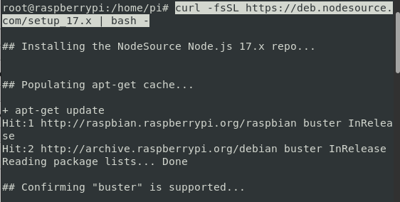

---: Install Node.js
---
# Install Node.js in Raspberry Pi

### Step 1 - Download and Run

Launch the Terminal and execute the command below. In our case, we are connecting to the Raspberry Pi over SSH.

```sh
sudo su
curl -fsSL https://deb.nodesource.com/setup_16.x | bash -
```



As of writing this post, the latest version of NodeJS is version 17. To get the newest nodejs repository, please check the [NodeSource GitHub page](https://github.com/nodesource/distributions/blob/master/README.md).

But I recommend not installing 17 but rather version 16. Every odd number of Node is a sort of experimental edition and should not be used in production.

### Step 2 - Next run the following command

```sh
sudo apt install nodejs
```

### Last step - Test Installation

```sh
node -- version
npm --version
```

All Done